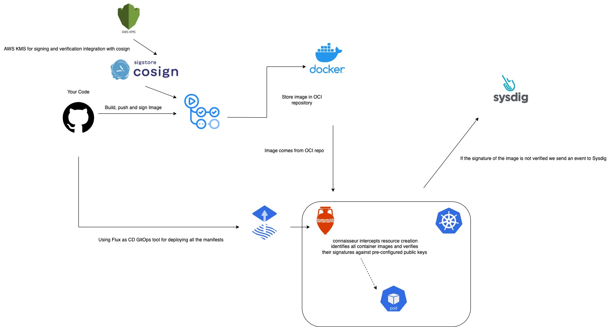
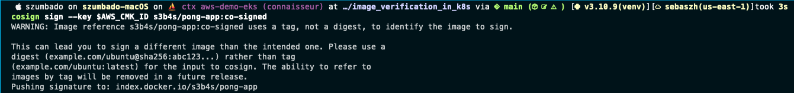
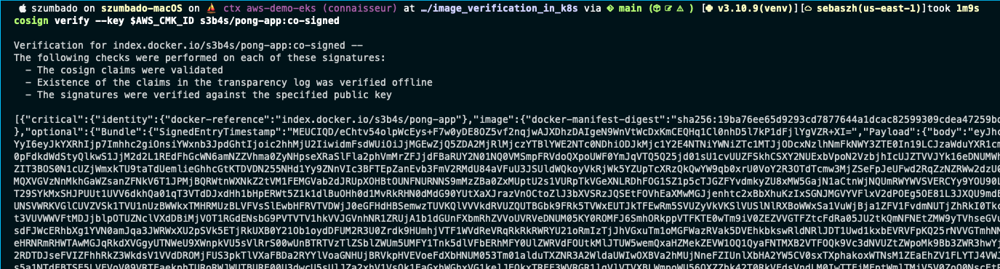
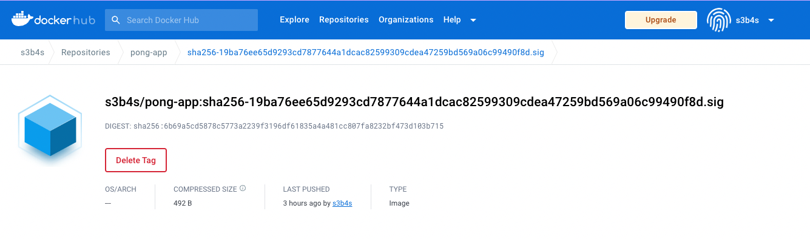
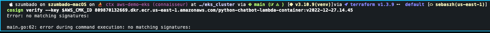
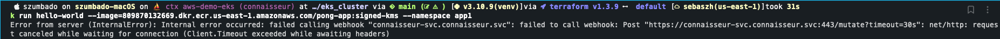
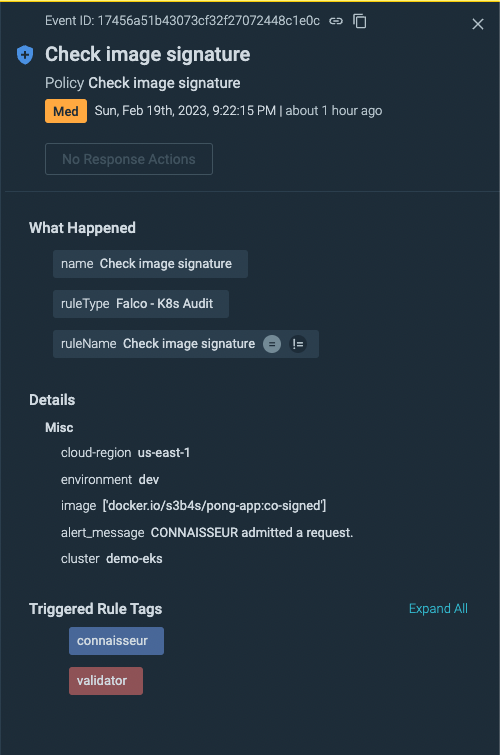
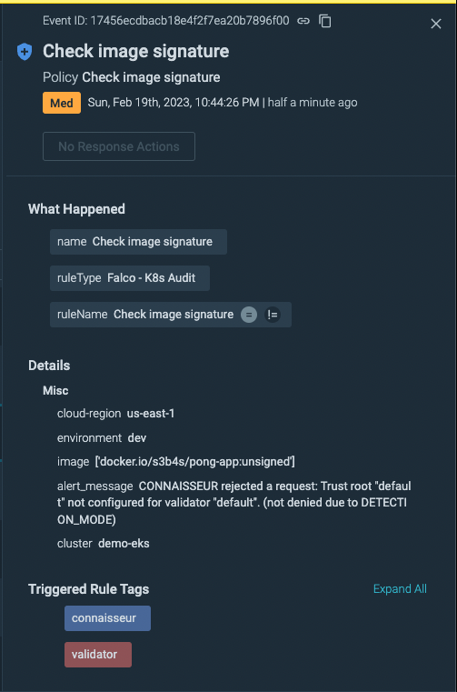

# POC of image signature and verification in Kubernetes clusters

To ensure secure deployment in a Kubernetes cluster, it's crucial to trust the images you deploy when running containers. We want to ensure that the images we are using are the expected ones, haven't mutated, and are verified.

In this POC we are going to demonstrate how can we create secure deployments ensuring that all the images we run have a correct signature and are verified by an admission controller. Firstly, we will sign and publish a container image to an OCI registry using [Cosign](https://github.com/sigstore/cosign), which is a crucial step in ensuring the authenticity and integrity of the image. Secondly, we will demonstrate how signature verification is performed in the Kubernetes cluster to ensure that only trusted images are deployed.

In addition, we will implement a policy to block unsigned images in a specific namespace and allow but warn on other namespaces thanks to [Connaisseur](https://sse-secure-systems.github.io/connaisseur/v2.7.0/), our admission controller. This will provide an extra layer of security to prevent the deployment of unverified or potentially malicious images in the cluster.

Finally, we will use Sysdig events UI to notify and alert us of any blocked or non-compliant images. This will enable us to quickly take action and investigate any potential security issues in the cluster.

Through this POC, we aim to demonstrate the importance of image verification and provide a practical example of how it can be implemented in a Kubernetes cluster to enhance security and reduce the risk of security breaches.


**Representation of the POC**

## Why do we need to care of verifying our container images?

Any container that is present in our cluster is running some piece of code under the hood that is encapsulated in an image. And that image is just a combination of filesystem layers that compose the root filesystem for that particular container. We can identify each layer by its SHA256 hash, usually, it's a long string (`sha256:19ba76ee65d9293cd7877644a1dcac82599309cdea47259bd569a06c99490f8d`) and as you can see that notation is not very handy for referencing an image, that's why we can use `v1.3.19` or `latest` as tags for that sha digest, however, that introduces tag mutability into the scenario which has its advantages and disadvantages. One bad disadvantage is that there is no guarantee that the tag corresponds to the expected image we want because an attacker can upload another layer to the image with malicious code and not change the tag name, so the SHA digest will change but not the tag name you see or scan. That's why we need to be sure of the image we are accepting into our environments, and that is why it's recommended to use digests instead of tags. By doing so, we can ensure that any subsequent image deployed in the Kubernetes cluster is identical to the one that was verified earlier in our pipeline and thus authenticated within our security process.

## How the image verification can be accomplished?

We are going to use cosign to solve the above issue and trust the images we are going to deploy in our environments. In this case for better management of the public, private, and password keys we are going to use AWS KMS so they can take care of managing all the keys and keep it secure and because we are also using an EKS cluster that integrates just good. In the end, we only need to pass the alias of the KMS key to cosign by the `--key` flag.

By the way, you can download cosign using the following command `brew install cosign` or use the `sigstore/cosign-installer@main` GitHub action for the below example.

We are using the [push image](https://github.com/S3B4SZ17/pong-app/actions/workflows/push-image.yaml) GitHub workflow as our CI tool for building signing and pushing our custom image to Docker Hub or an ECR registry. As a side note, you can check the [pong-app](https://github.com/S3B4SZ17/pong-app) repo that it's just a Golang app micro-service example that exposes the `api/ping` endpoint using the GinGonic framework and answers with a pong message defined in a yaml config file. Below you can see the step where we are using cosign and the AWS KMS `cosign-key` alias we previously created. The action needs to assume the proper role with custom policy and actions to access the key, refer to this [guide](https://docs.aws.amazon.com/kms/latest/developerguide/kms-api-permissions-reference.html) for more details.

```yaml
    - name: Build, tag, signed and push image to Docker Hub
      if: steps.set-image-defaults.outputs.sign_image == 'true' && steps.set-image-defaults.outputs.to_ECR == 'false'
      env:
        USER: ${{ secrets.DOCKER_USERNAME }}
        REPO: ${{ steps.set-image-defaults.outputs.image_repo }}
        IMAGE_TAG: ${{ steps.set-image-defaults.outputs.image_tag }}
      run: |
        docker build -t $USER/$REPO:$IMAGE_TAG ./src
        docker push $USER/$REPO:$IMAGE_TAG
        IMAGE_DIGEST=$(docker inspect $USER/$REPO:$IMAGE_TAG | jq -r '.[0].RepoDigests[0]' | cut -d'@' -f2)
        AWS_CMK_ID="awskms:///arn:aws:kms:us-east-1:809870132669:alias/cosign-key"
        cosign sign --key $AWS_CMK_ID $USER/$REPO:@$IMAGE_DIGEST
        cosign sign --key $AWS_CMK_ID $USER/$REPO:$IMAGE_TAG

```

An important point is that you need to first push the image to the registry to get the SHA digest of the image, you can not get the digest before pushing it. As you can see we are signing the digest of the image in this step `cosign sign --key $AWS_CMK_ID $USER/$REPO:@$IMAGE_DIGEST` that is the one we should use, however for simplicity we are using as well the `IMAGE_TAG=co-signed` for an easier exemplification. Cosign will show you the same warning.



And you can use the `verify` command with cosign for the verification of your image.



The result of the signature is a new tag in the registry with the SHA digest and `.sig` termination.



Below is what you will see if an image is not verified and is not signed



## Verifying image for new K8s deployments

Now let's apply the same logic as before for verifying the image but in this case to the process of creating new K8s pods and containers. We are going to use [Connaisseur admission controller](https://sse-secure-systems.github.io/connaisseur/v2.7.0/). An admission controller in K8s is a gatekeeper that intercepts and processes requests to the Kubernetes API before the persistence of the object.

Since I am using flux to deploy infrastructure in my EKS cluster and following the GitOps principle everything is stored in the [image\_verification\_in_k8s](https://github.com/S3B4SZ17/image_verification_in_k8s) repository, yeah even the k8s secrets and the Sysdig secure API token that we are going to use later, of course, I am using [SOPS](https://fluxcd.io/flux/guides/mozilla-sops/) for encrypting and decrypting them.

In the `infrastructure/sources/external-sources` path, I am defining my `HelmRepository` objects, in this case, I forked the Connaisseur chart into https://s3b4sz17.github.io/connaisseur/helm, the reason I forked it I explain it later. Then in the `infrastructure/for-dev/connaisseur` folder, we are defining the kustomization for the different objects the chart will need, like the namespace with some flux-specific annotations, version of it, and from where to get the values.yaml. In this case, we want to block unsigned images in a specific namespace and allow but warn on other namespaces, to achieve this we need to set the following configuration

```yaml
# values.yaml #
namespacedValidation:
  enabled: true
  mode: validate

detectionMode: true
```

With the `namespacedValidation` Connaisseur will only verify the trust of images deployed to the configured namespaces. The validation is based on a label of the namespace `securesystemsengineering.connaisseur/webhook: validate`, use the `ignore` value if you want to omit a namespace.

The `detectionMode` option will admit all images to the cluster, but issues a warning and logs an error message for images that do not comply with our defined policies. If false we are not going to admit an image and the pods won't be created. Basically choose between Alerting or Blocking. In a production or enterprise-level scenario, you would like to start with just the detection policy that alerts any untrusted images but does not block deployments. Once you test it out and have a solid pipeline you can enforce the blocking policy by namespace.

Now let's explore the policies and validators we can configure for Connaisseur. In the next configuration we are defining the pattern of our image from an ECR private registry and a public one in Docker Hub, note the star at the end for regex matching.

```yaml
policy:
  - pattern: "809870132669.dkr.ecr.us-east-1.amazonaws.com/aws_kube:co*"
    validator: myvalidator
    with:
      key: val_key
  - pattern: "docker.io/s3b4s/pong-app:co*"
    validator: myvalidator
    with:
      key: val_key
```

Then we instruct to use `myvalidator` and the `val_key` for those patterns. That way we are using cosign and the AWS KMS key that we specified before as an alias for doing the verification signature.

```yaml
validators:
  - name: myvalidator
    type: cosign
    trust_roots:
    - name: default
      key: awskms:///arn:aws:kms:us-east-1:809870132669:alias/cosign-key
```

Take into account that with the default configuration of the Connaisseur chart we are able to run official images from the docker hub but any other ones will be rejected. Since we are defining a private registry and also need to authenticate to AWS to get the KMS key we need to configure it based on this [documentation](https://sse-secure-systems.github.io/connaisseur/v2.7.0/validators/sigstore_cosign/#authentication), we can create a docker-registry type secret in the Connaisseur namespace and refer to it in the `auth` section of the values.yaml or you can also annotate the service Connaisseur with the ARN role to assume thanks to [IRSA](https://docs.aws.amazon.com/eks/latest/userguide/iam-roles-for-service-accounts.html) that will inject the credentials to the necessary pods.

### Troubleshooting Connaisseur chart

One error that took me some time to debug and solve is the next one.



```bash
Error from server (InternalError): Internal error occurred: failed calling webhook "connaisseur-svc.connaisseur.svc": failed to call webhook: Post "https://connaisseur-svc.connaisseur.svc:443/mutate?timeout=30s": net/http: request canceled while waiting for connection (Client.Timeout exceeded while awaiting headers)
```

From what it says there was a timeout trying to reach the `connaisseur-svc.connaisseur.svc` service webhook, after looking at CNI issues with my newly created EKS cluster I found that actually, the solution was quite simple. I first took a look at the `MutatingWebhookConfiguration` to see that the values were the correct ones and to check if I was able to increase the time-out seconds.

`k describe MutatingWebhookConfiguration connaisseur-webhook -n connaisseur`

```yaml
Name:         connaisseur-webhook
Namespace:
Labels:       app.kubernetes.io/instance=connaisseur
              app.kubernetes.io/managed-by=Helm
              app.kubernetes.io/name=connaisseur
              helm.sh/chart=connaisseur-1.5.0
Annotations:  helm.sh/hook: post-install, post-upgrade, post-rollback
API Version:  admissionregistration.k8s.io/v1
Kind:         MutatingWebhookConfiguration
Metadata:
  Creation Timestamp:  2023-02-19T10:16:39Z
  Generation:          1
  Managed Fields:
    API Version:  admissionregistration.k8s.io/v1
...
    Service:
      Name:        connaisseur-svc
      Namespace:   connaisseur
      Path:        /mutate
      Port:        443
  Failure Policy:  Fail
  Match Policy:    Equivalent
  Name:            connaisseur-svc.connaisseur.svc
  Namespace Selector:
    Match Expressions:
      Key:       securesystemsengineering.connaisseur/webhook
      Operator:  In
      Values:
        validate
  Object Selector:
  Reinvocation Policy:  Never
  Rules:
    API Groups:
      *
    API Versions:
      *
    Operations:
      CREATE
      UPDATE
    Resources:
      pods
      deployments
      replicationcontrollers
      replicasets
      daemonsets
      statefulsets
      jobs
      cronjobs
    Scope:          *
  Side Effects:     None
  Timeout Seconds:  30
Events:             <none>
```

But the hint was when checking the service `kubectl describe service connaisseur-svc -n connaisseur`

```yaml
Name:              connaisseur-svc
Namespace:         connaisseur
Labels:            app.kubernetes.io/instance=connaisseur
                   app.kubernetes.io/managed-by=Helm
                   app.kubernetes.io/name=connaisseur
                   helm.sh/chart=connaisseur-1.5.0
                   helm.toolkit.fluxcd.io/name=connaisseur
                   helm.toolkit.fluxcd.io/namespace=connaisseur
Annotations:       meta.helm.sh/release-name: connaisseur
                   meta.helm.sh/release-namespace: connaisseur
Selector:          app.kubernetes.io/instance=connaisseur,app.kubernetes.io/name=connaisseur
Type:              ClusterIP
IP Family Policy:  SingleStack
IP Families:       IPv4
IP:                172.20.206.246
IPs:               172.20.206.246
Port:              http  443/TCP
TargetPort:        5000/TCP
Endpoints:         <none>
Session Affinity:  None
Events:            <none>
```

You need to look at the `TargetPort` and since I just provisioned a new EKS cluster turned out it was a firewall rule, you need to enable ports on the nodes, so I had to allow port 5000.

## Sending the alerts to Sysdig

Here comes the explanation of why I forked the [connaisseur](https://github.com/S3B4SZ17/connaisseur) repo. With the default connaisseur helm chart, we can easily define an event payload to send the alerts, that is why I created the [sysdig.json](https://github.com/S3B4SZ17/connaisseur/blob/master/helm/alert_payload_templates/sysdig.json) template where we define the JSON payload we are going to send to the `receiver_url` , in this case, the Sysdig Dispatch ingests endpoint https://us2.app.sysdig.com/api/v1/eventsDispatch/ingest. For authenticating we need to pass the Bearer token in the headers and we can define that in the `custom_headers` key. Here is the final result:

```yaml
alerting:
  cluster_identifier: demo-eks
  admit_request:
    # Creating a new template called sysdig.json inside ./connaisseur/helm/alert_payload_templates
    templates:
      - template: sysdig
        receiver_url: https://us2.app.sysdig.com/api/v1/eventsDispatch/ingest
        fail_if_alert_sending_fails: true
        priority: 1
        custom_headers:
          - 'Authorization: Bearer ****************'
  reject_request:
    templates:
      - template: sysdig
        receiver_url: https://us2.app.sysdig.com/api/v1/eventsDispatch/ingest
        fail_if_alert_sending_fails: true
        priority: 4
        custom_headers:
          - 'Authorization: Bearer *****************'' 
```

Notice that we are using the `sysdig` template and that name needs to comply with the JSON file we place under the `helm/alert_payload_templates/sysdig.json` path. Now since these `values.yaml` configuration now has the Authorization Bearer token for Sysdig I don't want to commit it as plain text to my repo. So we can use this [guide,](https://fluxcd.io/flux/guides/mozilla-sops/) first generate a set of GPG keys to encrypt the whole `values.yaml` file, upload the `clusters/dev/demo-eks/.sops.pub.asc` key to the repo and tell flux to use `sops` as the backend provider for decryption and use a preconfigured `sops-gpg` secret with the pub and secret key in the cluster. This will be the final secret encrypted that has the values.yaml [clusters/dev/demo-eks/connaisseur-values.yaml"](https://github.com/S3B4SZ17/image_verification_in_k8s/blob/main/clusters/dev/demo-eks/connaisseur-values.yaml)) config for connaisseur. Then in the helm release for the chart `spec.valuesFrom` you point to that custom secret.

The final result in Sysdig is the following.

An admitted request for a signed image:



A denied request:



## Conclusion

We can conclude that secure deployments can be achieved by ensuring that all images running in a Kubernetes cluster have a correct signature and are verified by an admission controller. In this POC, we have demonstrated how to sign and publish container images to an OCI registry using Cosign, which helps to ensure the authenticity and integrity of the images.

We have also shown how signature verification can be performed in the Kubernetes cluster to guarantee that only trusted images are deployed. To add an extra layer of security, we implemented a policy to block unsigned images in a specific namespace and allow but warn in other namespaces, thanks to the admission controller Connaisseur.

Finally, we used the Sysdig events UI to receive notifications and alerts of any blocked or non-compliant images, which enables quick action and investigation of any potential security issues in the cluster. This POC highlights the importance of image verification and provides a practical example of how it can be implemented in a Kubernetes cluster to enhance security and minimize the risk of security breaches.